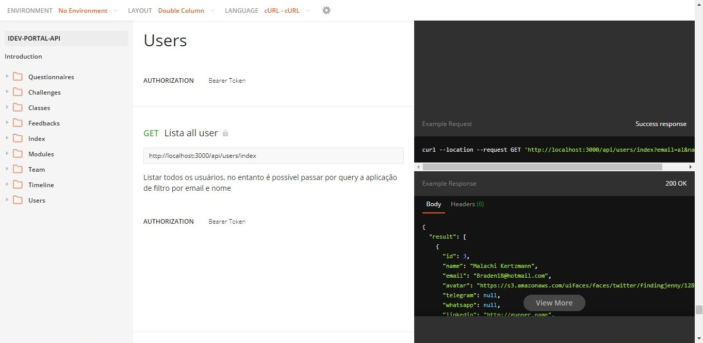

# idev_portal

Portal gameficado de aprendizado colaborativo para a comunidade IDEV,

##### Link da API

###### BASE URL: <https://idev-app.herokuapp.com/api/>

[Clique aqui](https://idev-app.herokuapp.com/api/ "Api")

- nodeJS,
- Sequelize,
- Javascript,
- EJS,
- CSS,
- mySQL

[Clique aqui para ver o protótipo no Figma](https://www.figma.com/proto/pcKXkGzI8VrrmDPcv1V9cN/Comunidade-IDEV?node-id=0%3A3&scaling=scale-down "Protótipo")

[Documentação da api](https://documenter.getpostman.com/view/9702967/T1LMj83K?version=latest "Documentação")

